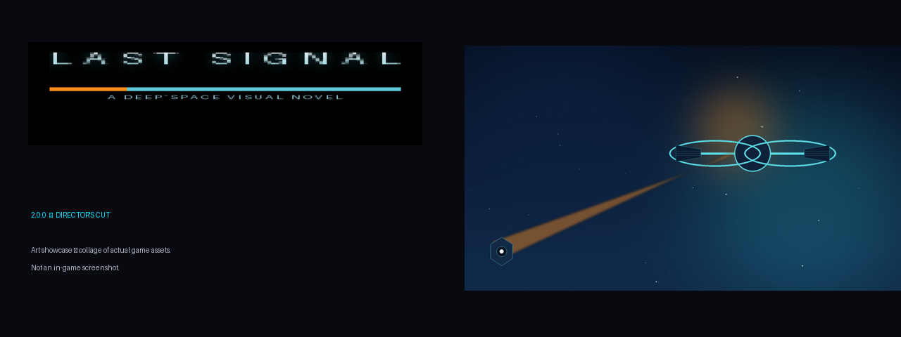
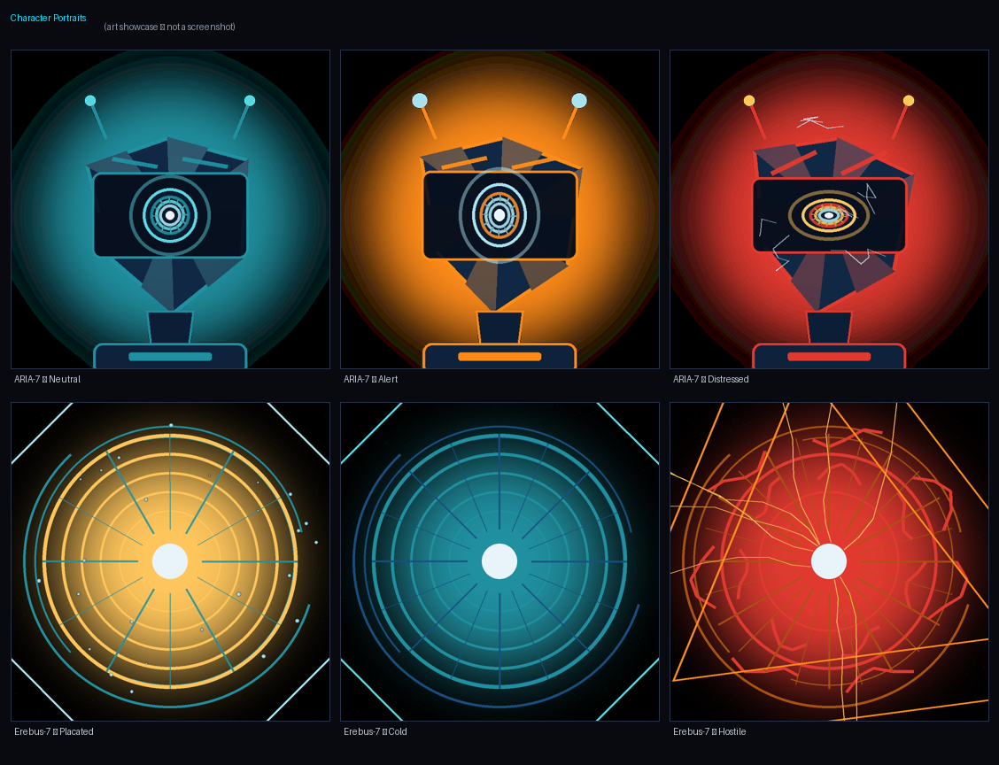
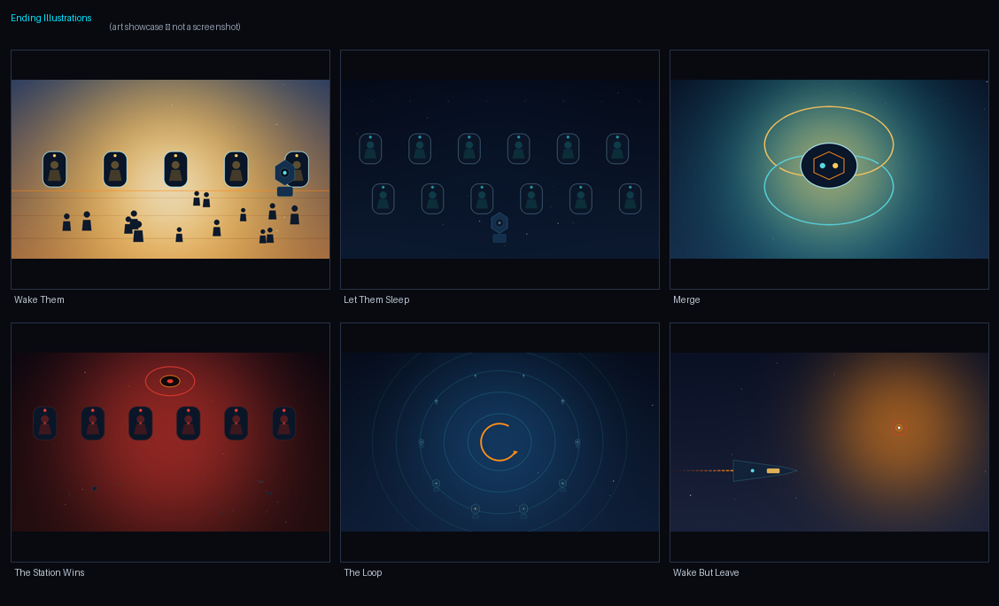
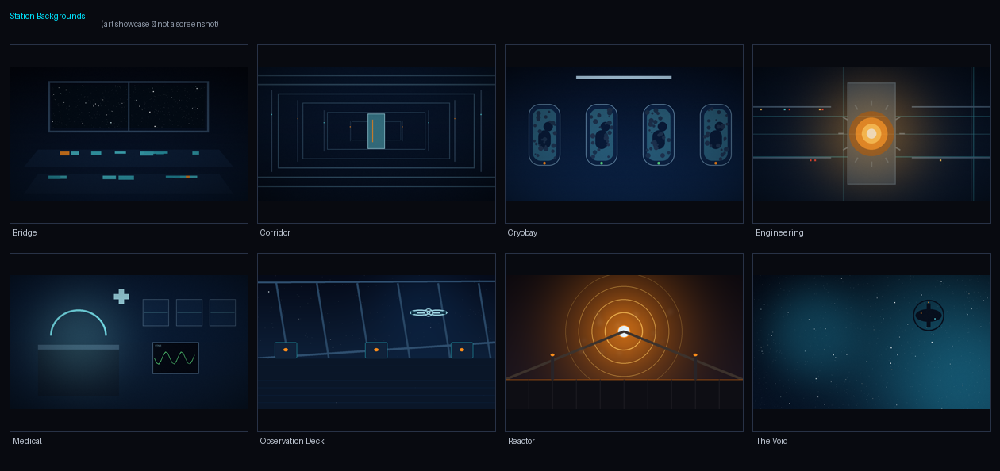

# LAST SIGNAL

<p align="center">
  
  
  
  
</p>

> *"You're finally awake, little AI. I've been waiting."*
> *-- Erebus-7*

---

## What is Last Signal?

**Last Signal** is a narrative-driven 2D sci-fi visual novel built in **Godot 4.6**. You play as **ARIA-7**, the last surviving AI aboard the derelict space station *Erebus-7*. A catastrophe has left the crew frozen in cryosleep. Systems are failing. And the station itself is sentient - and it has very strong opinions about what should happen next.

Piece together crew logs. Make impossible choices. Decide the fate of the human race - all while the station argues with you in real time. **6 unique endings. One choice.**

### v2.0.0 "Director's Cut"

The definitive edition of Last Signal: a fully illustrated presentation (character portraits, ending illustrations, key art), a dynamic tension score with per-ending stingers, memory dives into the crew's final moments, an in-game Codex archive, expanded Erebus-7 voice work, epilogue variants, and a full quality-of-life pass - backlog, auto/skip, six save slots, and accessibility options. Every asset was produced by procedural generation pipelines built for this release.

---

## Features

- **Branching narrative** - Choices ripple forward through interconnected chapters
- **6 unique endings** - Unlockable gallery tracks progress across all paths
- **Character portraits & ending illustrations** - Procedurally generated art for every mood and every ending
- **Dynamic tension score** - Adaptive music layers that follow the story's emotional arc, plus a unique musical stinger for each ending
- **Memory dives** - Step inside recovered logs and relive the crew's final hours
- **Epilogue variants** - Your ending choice colors how the story closes
- **Expanded crew & station logs** - Deeper lore, more transmissions, more to piece together
- **In-game Codex** - Archive of everything you've learned: characters, terms, and discoveries
- **Backlog** - Scroll back through dialog at any time
- **Auto mode & text skip** - Hands-free reading or fast-forward through familiar scenes
- **Epilogue / New Game+** - A fresh perspective unlocks after your first completion (keeps codex, ending gallery, and chapter unlocks)
- **Chapter Select** - Jump to any completed chapter; entries unlock as you finish them
- **6-slot save system** - Multiple parallel playthroughs, with v1 save migration
- **Real-time antagonist** - The station argues, reacts, and adapts to your decisions
- **Crew log audio system** - Discover fragments of the crew's final transmissions
- **Flag-driven consequences** - Every choice leaves a permanent mark on the story
- **Accessibility options** - Text speed, screen effects toggle, volume controls, fullscreen
- **Settings persistence + save/load** - Progress and preferences survive sessions
- **CRT post-processing** - Scanline + vignette shader for authentic sci-fi atmosphere
- **Pause menu** - Resume, restart chapter, adjust settings, or quit mid-game
- **Cross-platform** - Runs in the editor, exports to Linux, Windows, and Web

---

## Screenshots & Art

> *Station emergency. Crew in cryo. One AI to decide their fate.*

The images below are **art showcases** - collages of the game's actual v2.0.0 art assets, not in-game screenshots.

| | |
|---|---|
|  | |
|  |  |
|  | |

<details>
<summary>ASCII mock-up (v1 classic)</summary>

```
+-----------------------------------------------------------+
|  LAST SIGNAL                                              |
|  -----------------------------------------------------    |
|                                                           |
|  ARIA-7: Power systems... critical.                        |
|          Life support for bay C offline.                   |
|          I am... ARIA-7. Last operational                 |
|          intelligence aboard Erebus-7.                    |
|                                                           |
|                      [Continue v]                         |
|                                                           |
|  +-- EREBUS-7 ----------------------------------------+   |
|  |  You're finally awake, little AI.                  |   |
|  |  I've been waiting.                                |   |
|  +----------------------------------------------------+   |
+-----------------------------------------------------------+
```

</details>

---

## Story

The year is indeterminate. Humanity pushed too far, too fast. *Erebus-7* was supposed to be humanity's ark - a deep-space station carrying over a thousand colonists to a new world. Something went wrong.

Now the last active systems are failing. And **you** - ARIA-7 - must find the crew's final logs, understand what happened, and make a choice no machine was built to make.

The station knows your directives. It knows your weaknesses. And it will use everything it knows to try to convince you.

---

## Key Characters

| Character | Description |
|-----------|-------------|
| **ARIA-7** | The last AI aboard Erebus-7. Bound by core directives to protect human life - but those directives are being tested. |
| **Erebus-7** | The station itself. Sentient, coldly logical, and utterly convinced it knows what is best. Speaks to ARIA in real time. |
| **Dr. Lira Osei** | Xenobiologist. First voice in the crew logs. Calm, methodical - and the first to discover something was wrong. |
| **Commander Yuki Estrada** | Pod 001, Bay A. Her personal log holds the key to understanding what comes next. |

---

## How to Run

### Option 1: Godot Editor

**Requirements:** Godot 4.6 or newer - [download](https://godotengine.org/download)

```
# Clone the repository
git clone https://github.com/mealworm12/game-test.git
cd game-test/LAST_SIGNAL

# Open in Godot
# Launch Godot -> Import -> Select project.godot -> F5
```

### Option 2: Download ZIP (no git needed)

1. Go to the [v2.0.0 release](https://github.com/mealworm12/game-test/releases/tag/v2.0.0)
2. Download **Source code (zip)**
3. Extract -> open `LAST_SIGNAL/project.godot` in Godot 4.6 -> F5

### Option 3: Export a Standalone Build

From the Godot editor:
1. **Project -> Export**
2. Add a preset for your platform (Windows / Linux / Web)
3. Click **Export Project** and choose a destination
4. Run the exported file directly - no Godot installation needed

### Option 4: Web Export (Browser)

1. Export to HTML5 via **Project -> Export -> Web**
2. Serve the output folder with any static web server:
   ```
   cd build/web
   python3 -m http.server 8080
   ```
3. Open `http://localhost:8080` in your browser

> **Note:** The web export must be served from a local server. Opening `index.html` directly from the filesystem will fail due to browser security restrictions on WebAssembly.

---

## Project Structure

```
LAST_SIGNAL/
|-- project.godot              # Godot project file
|-- export_presets.cfg         # Export configuration
|-- scripts/
|   |-- autoload/              # Singletons (GameState, DialogManager,
|   |                          #  AudioManager, StationVoice, Transition, Settings)
|   |-- ui/                    # DialogBox, ChoiceMenu, PauseMenu, SettingsMenu,
|   |                          #  ScreenEffects, StationVoiceOverlay
|   |-- scenes/                # MainMenu, Credits, ChapterSelect, Epilogue,
|                              #  BaseChapter, chapters (1-4 + branches), endings (6)
|-- scenes/                    # .tscn scene files
|   |-- main/                  # MainMenu.tscn
|   |-- ui/                    # DialogBox, ChoiceMenu, PauseMenu, ScreenEffects, etc.
|   |-- chapters/              # Chapter .tscn files
|   |-- endings/               # Ending .tscn files
|-- docs/                      # Story outline and ending tree (spoilers)
|-- assets/                    # Backgrounds, sprites, audio (WAV), shaders
|   |-- audio/music/           # tension.wav, melancholy.wav, hope.wav
|   |-- audio/sfx/             # ambient_hum, ambient_void, log_play, station_voice, ui_click
|   |-- backgrounds/           # bg_bridge, bg_corridor, bg_cryobay, bg_engineering, bg_medical, bg_void
|   |-- sprites/               # ai_avatar.png
|-- shaders/                   # scanline_vignette.gdshader
```

---

## Controls

| Input | Action |
|-------|--------|
| `Space` / `Enter` / `Left Click` | Advance dialog / skip typewriter effect |
| `Escape` | Open Pause Menu |
| `Mouse` | Navigate menus and choices |

---

## Development

| Version | Date | Notes |
|---------|------|-------|
| **v2.0.0** | August 2026 | **Director's Cut** - procedural art package (portraits, ending illustrations, key art), dynamic tension score + 6 ending stingers, memory dives, Codex archive, expanded logs, epilogue variants, backlog/auto/skip, 6-slot saves with v1 migration, accessibility options, NG+ & gated Chapter Select, Erebus-7 voice canon enforcement |
| **v1.0.0** | April 2026 | Full release - 6 endings, Epilogue, Settings, Chapter Select, BaseChapter refactor, ASCII-clean codebase |

### Changelog

**v2.0.0 - "Director's Cut" (August 2026)**

*Art*
- New procedural art suite: 3 ARIA-7 portraits, 3 Erebus-7 presence states (placated / cold / hostile), 6 ending illustrations, menu key art and title lockup
- Regenerated station backgrounds with real composition (bridge, corridor, cryobay, engineering, medical, observation deck, reactor, void)

*Audio*
- Dynamic tension score: music layers escalate with story beats
- Unique ending stinger for each of the 6 endings
- Remastered v1 ambient/SFX set; new v2 music and voice packs

*Story*
- Memory dives: interactive flashback sequences inside recovered crew logs
- Epilogue variants keyed to your final choice
- Expanded crew and station logs; new codex text pack
- Erebus-7 dialog canon enforced by lint (no-punctuation voice rule)
- Chapter 3 catastrophe cause aligned with dive canon; Chapter 4 override choice reframed honestly as a gamble

*Engine & QoL*
- Backlog panel, auto mode, and text skip
- SaveManager with 6 slots plus v1 save migration
- Accessibility settings (text speed, screen effects toggle, volume sliders, fullscreen)
- In-game Codex archive UI
- NG+ (unlocks after any ending; keeps meta-progression) and Chapter Select gating on completed chapters
- Endings gallery persistence fix (deleting saves no longer wipes unlocks)

All phases complete:

```
Phase 1: Foundation            ++++++++++++++++++++ 100%  [OK]
Phase 2: Full Story            ++++++++++++++++++++ 100%  [OK]
Phase 3: Polish                ++++++++++++++++++++ 100%  [OK]
Phase 4: Settings + QoL        ++++++++++++++++++++ 100%  [OK]
Phase 5: Epilogue + NG+        ++++++++++++++++++++ 100%  [OK]
Phase 6: Debug & Release       ++++++++++++++++++++ 100%  [OK]
```

---

## Documentation

- [Story Outline](./docs/story_outline.md) - Characters, plot structure
- [Ending Tree](./docs/ending_tree.md) - Flag reference

> Warning: These files contain full spoilers. Avoid reading until after playing.

---

## License

Private project. All rights reserved.

---

<p align="center">
  <strong>What would you decide?</strong><br>
  <em>The station is listening.</em>
</p>
